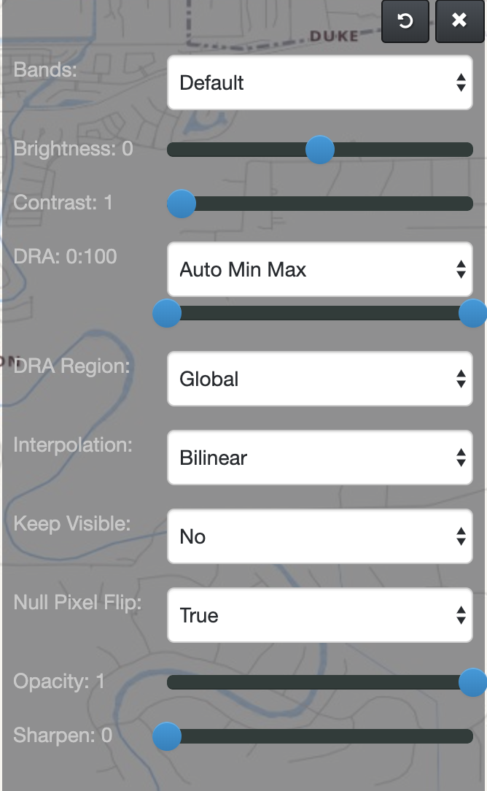

# Time Lapse Viewer

TLV serves two main purposes...

1. It is a viewer that shows orthorectified imagery from the O2 database.
2. It is able to show several images in a flip-book fashion, allowing users to quickly look through stacks of imagery.

## Map
* **Mouse Coordinates:**
The coordinate of the mouse is displayed in the lower-left corner of the map. Click the box to cycle through DD, DMS and MGRS formats. Right-click anywhere on the map to get a dialog box of that coordinate in all three formats.

* **Rotation:**
In 2D mode you can rotate the map by holding Shift + Alt while clicking and dragging. In 3D mode, you can hold Alt while clicking and dragging to pitch the globe.

## TLV Controls
These can be found in the top-left corner of the ViewPort and are used when navigating between two or more images in TLV.

### Control Descriptions
* **&nbsp;:**
Go back to the previous image on the stack.
* **&nbsp;:**
Start automatically flipping through images on the stack.
* **&nbsp;:**
Stop automatically flipping through images on the stack.
* **&nbsp;:**
Go forward to the next image on the stack.
* **&nbsp;:**
Delete the current image from the stack.
* **&nbsp;:**
Open the Stack Summary Table to easily view the whole stack and move/delete images from it along with an abbreviated composition of metadata..

## **&nbsp;** : Home
Click this to go back to the main O2 home page.

## **&nbsp;** : Search
* **End Date:**
The end date of the search. The default is now.
* **Library:**
You can select one or more libraries from which to search for imagery. Each selected library will be searched one at a time and the results will be aggregated and sorted before they are returned to the browser.
* **Location:**
This will be the center point around which the search is conducted. TLV will bring its A game and attempt to automatically detect which coordinate format you enter. _Note: You can add TLV's custom search toolbar plugin to your browser and use it to search for imagery just like you would when searching for anyting else._
* **Max. Cloud Cover (%):**
The maximum amount of cloud cover you want in any of the images that are returned. The default is 100.
* **Max. Results:**
The total amount of images you are willing to look through. The default is 10. The ability to examine large amounts of imagery relies heavily on available browser/computer resources.
* **Min. Niirs:**
The minimum NIIRS (National Imagery Interpretability Rating Scale) in which you are interested. The default is 0.
* **Sensor:**
Discriminate results to specific sensor types.
* **Start Date:**
The start date of the search. The default is 30 days prior to today.

## **&nbsp;** : Annotations
* **Toggle Visibility:**
Click to make all annotation disappear or reappear.
* **Circle:**
Click to begin a circle center and then click again to end it.
* **Line:**
Click to begin a line and click again each time you want a new vertex. Double-click to end the line.
* **Point:**
Just click anywhere.
* **Polygon:**
Click to begin a polygon and click again each time you want a new vertex. Double-click to close the polygon.
* **Rectangle:**
Click to start a rectangle and then click again to close it.
* **Square:**
Click to start a square center and then click again to close it.
* **Modify:**
Click on any annotation to modify its style.

## **&nbsp;** : Export
* **GIF:**
Create a GIF using all images currently in the image stack.
* **Metadata:**
This will take all the metdata from all the layers, convert it to a CSV file and allow you to download it. TLV harvests as much metadata as it can from its libraries and does not make any attempt to change or normalize the data. What TLV sees is what you get.
* **KML:**
Export a KML file to the desried image(s).
* **Link:**
Get a sharable link to the current image in TLV.
* **Screenshot:**
Think of it like the map taking a selfie. #nofilter
* **Template:**
Creates a template of the image stack which you can then download as a png.
* **WMS GetCapabilities:**
Returns the WMS GetCapabilities for the current image.

## **&nbsp;** : Image Properties
* **Bands:**
For multi-banded imagery, the red, green and blue "color guns" can be routed to any band within the image. Please aim responsibly.
* **Brightness:**
Uniformly adjust the brightness value of each pixel.
* **Contrast:**
Uniformly adjust the contrast value of each pixel, making the light pixels lighter and the dark pixels darker.
* **Dynamic Range Adjustmet:**
Adjust the ratio of the brightest to darkest pixel. Have you had your coffee yet, because this is about to get statistical. If you take the brightness value of each pixel and make a histogram (that bell-curve thing from school that you always seemed to be on the wrong side of) you'll end up with some kind of overall shape. The DRA setting literally "stretches" or "squishes" that shape. Then all those brighrness values are redistributed which can greatly enhance the overall image.
* **Interpolation:**
Select the method by which unknown pixels are determined from known pixels. Things get complicated during image processing, for example, when enlarging an image. If you end up with more pixels than you started, how do you determine what those new pixels look like? Do you poll the audience, phone a friend or maybe just look at the neighboring pixels?
* **Null Pixel Flip:**
If true pixels with a null value will display black instead of transparent.
* **Sharpen Mode:**
Select the kernel size used for sharpening. You can also try squinting really hard to bring things into focus.

## **&nbsp;** : Layers
* **Base Layer:**
Select from an assortment of base layers to bring context to the imagery.
* **Cross-Hair:**
As the name implies, this places a cross-hair in the center of the map. Whether you are looking to zero-in on the bad guy or just want to center the map on a particular target, this will get the job done.
* **Search Origin:**
This will place a marker on the map that indicates the exact location used for the center point search. All the zooming and panning can sometimes disorient you worse than someone waking you up from deep REM sleep. So, in case you forget the point around which you actually were searching, we’ve got you covered.
* **Overview Map:**
As the name implies, this shows an overview map that will follow you around as you pan and zoom in and out. In a friendly way though, we promise.

## **&nbsp;** : Tools
* **Geo-Jump:**
Go to any place on the map that your heart desires.
* **Measure:**
Use this tool for getting accurate distances and areas on an image by drawing directly on it.
* **Orientation:**
* * **Manual:**
You are responsible for your own rotation (and pitch, tilt, etc. if you’re in 3D).
* * **Auto:**
TLV will attempt to use your device’s internal sensors to orient the imagery in real-time to align itself with your device’s "view".
* **Reverse Order:**
The default order of the image stack is chronological. But, if you prefer the other way, here’s where to do it.

## **&nbsp;** : View
* **Dimensions:**
If your browser supports it, TLV will give you a 3D view of your images!
* **Swipe:**
Swipe an image over another. This is TLV's version of "wax on, wax off"... only instead of wax, it's imagery. At no extra charge we put in a "right-click-hold" short-cut to this feature.
* **Terrain Wireframe:**
Overlay a raw wireframe representation of your terrain.
* **Image Space:**
Feeling like your image is a little squished? Try looking at it in "un-orthorectified"/"as-the-sensor-took-the-image" kind of view.
* **WMS Tiles:**
Instead of your map being composed of multiple tiles that fill in as they are ready, switch to a single tile (to rule them all), if you're in to that kind of thing.

## **&nbsp;** : Help
* **About:**
Display a dialog box giving details on the instance of TLV.
* **User Guide:**
We all need help sometimes, this gets you there straight away.
